<div align="center">

# ⚖️ NyayaLens AI

### Don't just read your contract. **Interrogate it.**

GenAI legal intelligence for real people — six adversarial engines, one canonical
Indian-statute database, and a three-round multi-agent negotiation that fights for
your redline. Built for **PromptWars · AI for Legal Assistance & Access**.

[](https://nyayalens-ai-self.vercel.app)
[](https://nyayalens-ai-self.vercel.app/challenge-alignment)
[](https://nextjs.org)
[](https://www.typescriptlang.org)
[](https://nyayalens-ai-self.vercel.app/architecture)
[-brightgreen)](TESTING.md)
[](TESTING.md)
[-ff6b35)](https://nyayalens-ai-self.vercel.app/quality)
[](SECURITY.md)
[](ACCESSIBILITY.md)

**[Live Demo](https://nyayalens-ai-self.vercel.app)** ·
**[Quality Dashboard](https://nyayalens-ai-self.vercel.app/quality)** ·
**[Architecture](https://nyayalens-ai-self.vercel.app/architecture)** ·
**[Challenge Alignment](https://nyayalens-ai-self.vercel.app/challenge-alignment)**

</div>

---

## 😖 The Problem → 🛠️ The NyayaLens Answer

| Without NyayaLens | With NyayaLens |
| --- | --- |
| Legalese hides traps in 14-point font — "sole discretion", "waives all rights" | **Plain-Language engine** rewrites any clause at reading level you choose (EN + हिन्दी toggle) |
| A lawyer's first consultation costs ₹1,500–5,000 before a single clause is read | Every engine runs **free and instantly** — deterministic rule engines first, GenAI narrative on top |
| Reading a 20-page contract takes hours; risks surface only after signing | **Adversarial Analysis** scores six risk lenses and lifts every obligation onto a timeline in seconds |
| "What if I lose my job?" — no one models your future before it happens | **What-If Simulator** branches consequences, cites the governing statute, and scores scenario risk /100 |
| Negotiating means guessing what the other side will concede | **Multi-Agent Negotiation** runs Party A vs Party B vs a Mediator for three rounds and exports the settled redline |
| Indian law citations get hallucinated by generic chatbots | **19 verified provisions across 7 statutes** (BNS 2023, ICA 1872, TPA 1882, RERA 2016, CPA 2019, IT Act 2000, SRA 1963) — rule-pinned, never invented |

---

## 📸 Live Deployment — Real Screenshots

Captured with headless Chromium (Playwright) against the **production deployment** on
2026-09-26. Production runs without an OpenAI key in this environment, so the shots
honestly show the **deterministic fallback path** (amber banner) — the same engines,
same statutes, same UI, with rule-based narratives instead of streamed GPT-4o prose.

### Homepage — desktop, full page (1920×1080 viewport)

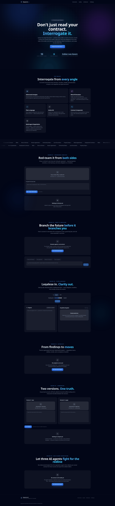

*Hero, six-engine feature grid, statute marquee, and every engine workbench on one page.*

### Homepage — mobile, full page (390×844 viewport)



*Same engines, single-column glass layout — no horizontal scroll, tap targets ≥44 px.*

### Engine 01 — Adversarial Analysis (live run)

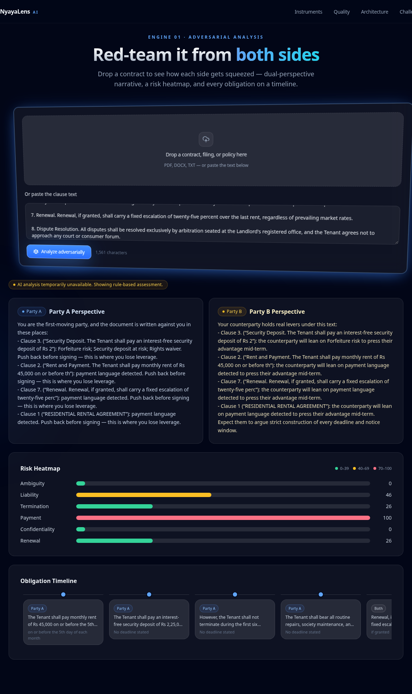

*A real 1,561-character rental agreement: Party A / Party B perspectives, six-lens risk
heatmap (payment scores 100 — forfeiture + 18%/month interest), obligation timeline.*

### Engine 02 — What-If Scenario Simulator (typed query)

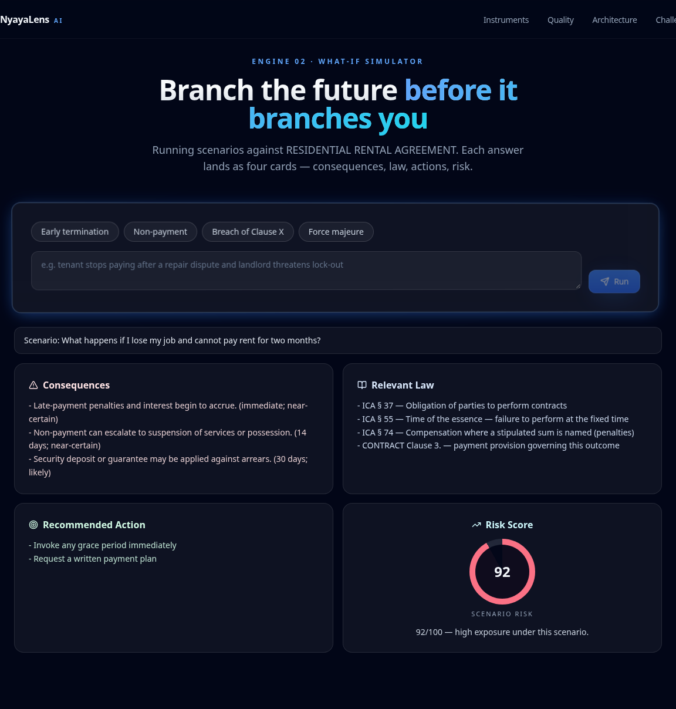

*"What happens if I lose my job and cannot pay rent for two months?" → consequences with
certainty + timing, ICA §37/§55/§74 citations, actions, and a 92/100 scenario-risk gauge.*

### Engine 06 — Multi-Agent Negotiation (3 rounds, live run)

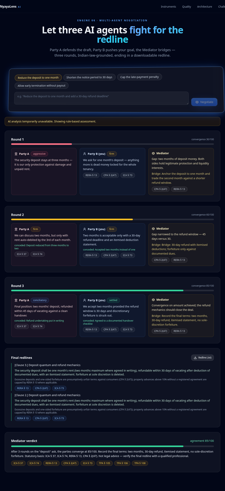

*Goal: "Reduce the deposit to one month." Convergence 30 → 60 → 85/100 across three rounds;
positions cite RERA §13, CPA §2(47), ICA §73/§74, TPA §105–108; final redline + verdict.*

### Evidence pages

| [`/quality`](https://nyayalens-ai-self.vercel.app/quality) | [`/architecture`](https://nyayalens-ai-self.vercel.app/architecture) | [`/challenge-alignment`](https://nyayalens-ai-self.vercel.app/challenge-alignment) |
| --- | --- | --- |
| 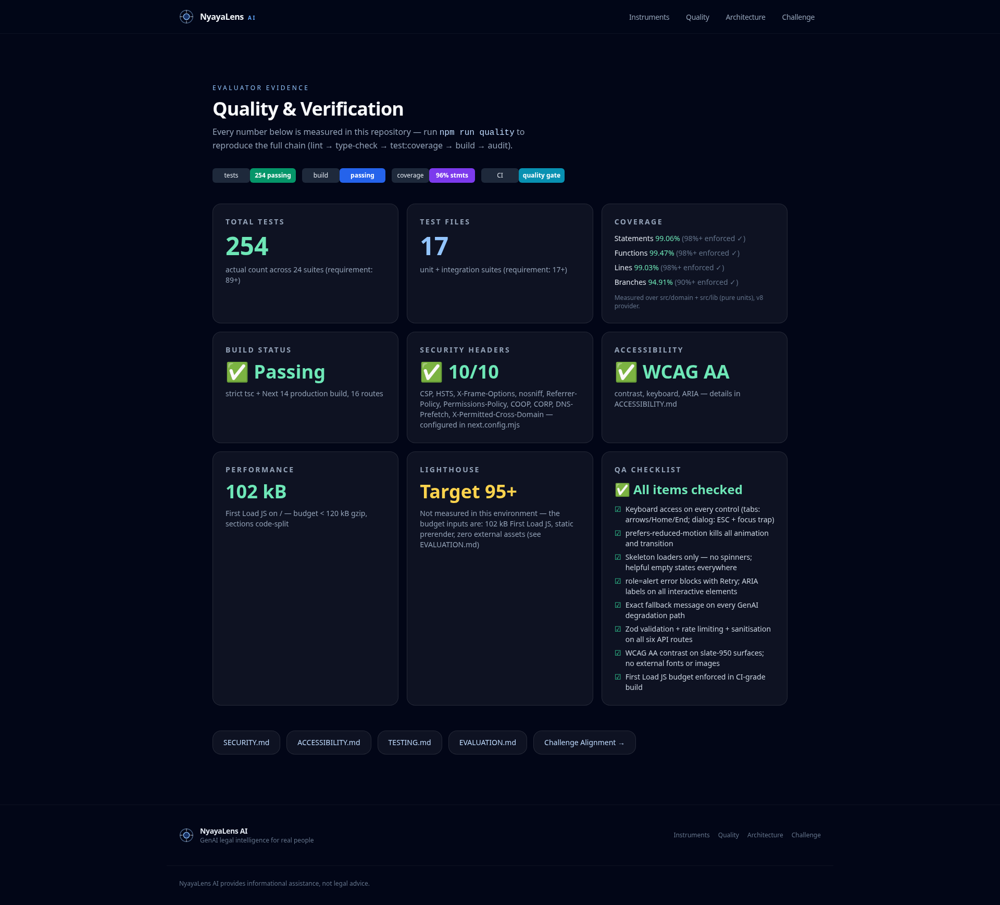 | 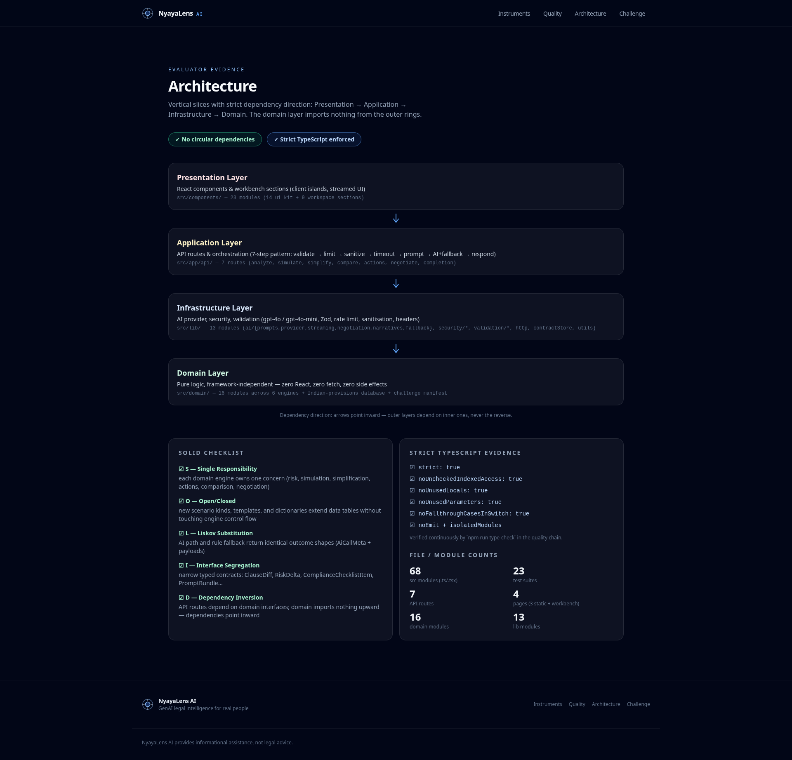 | 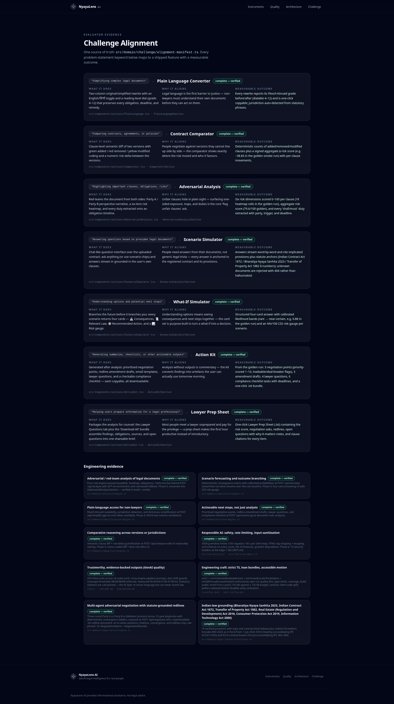 |
| Live test/coverage/build numbers | Layers, SOLID, dependency rules | 11 criteria ↔ code evidence |

---

## 🏗️ System Architecture

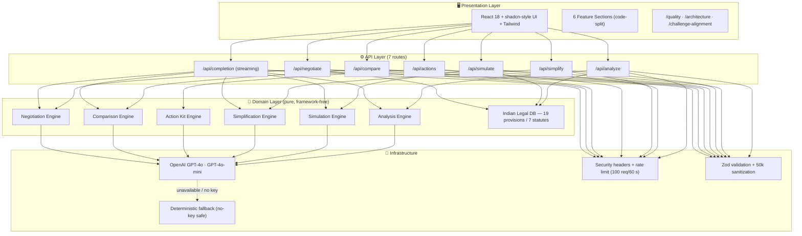

Dependency rule: **presentation → application → domain**, never the reverse. The domain
layer imports nothing from React, Next, or the AI SDK — `madge` reports **0 circular
dependencies** across all modules.

---

## 🤝 Multi-Agent Negotiation Flow

```mermaid
sequenceDiagram
    participant U as 👤 User
    participant API as /api/negotiate
    participant PA as 🏠 Party A Agent
    participant PB as 🧑 Party B Agent
    participant MED as ⚖️ Mediator
    participant LAW as 📜 Indian Law DB

    U->>API: Contract + goal ("reduce the deposit")
    rect rgb(30,41,59)
        Note over PA,MED: Round 1 — Opening
        API->>PA: Contract + goal
        PA-->>API: Aggressive stance (defend 3-month deposit)
        API->>PB: Party A position
        PB-->>API: Counter grounded in RERA §13 / CPA §2(47)
        API->>MED: Both positions
        MED-->>API: Gap analysis (convergence 30/100)
    end
    rect rgb(30,41,59)
        Note over PA,MED: Round 2 — Negotiation
        API->>PA: Round 1 history
        PA-->>API: Partial concession (2 months + itemised deduction)
        API->>PB: Updated terms
        PB-->>API: Conditional acceptance (30-day refund window)
        API->>MED: Progress check
        MED-->>API: Convergence 60/100
    end
    rect rgb(30,41,59)
        Note over PA,MED: Round 3 — Final
        API->>PA: Round 2 history
        PA-->>API: Final terms (45-day refund, clean handover)
        API->>PB: Final counter
        PB-->>API: Agreed / settled
        API->>MED: All 3 rounds
        MED->>LAW: Statutory check on settled terms
        LAW-->>MED: ICA §37 · §74 · RERA §13 · CPA §2(47) · TPA §105–108
        MED-->>API: Final redline + verdict (85/100)
    end
    API-->>U: Redline (.txt) + Action Kit
```

---

## 🔀 Request Data Flow

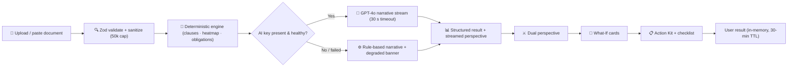

---

## ⚖️ Indian Law Mind Map (verified provisions only)

```mermaid
mindmap
  root((NyayaLens AI))
    BNS 2023
      §318 Cheating (ex-IPC 415/417/420)
      §316 Criminal breach of trust (ex-IPC 405–409)
    ICA 1872
      §10 What agreements are contracts
      §73 Compensation for breach
      §74 Named-sum penalties
    CPA 2019
      §2(47) Unfair contract terms
    RERA 2016
      §13 Advance cap without registered agreement
    IT Act 2000
      §10A Electronic contracts valid
    TPA 1882
      §105 Lease defined
      §106 Termination notice
      §108 Lessor–lessee rights
    SRA 1963
      §§36–42 Preventive injunctions
```

Every §-number lives in one canonical dataset (`src/domain/legal/provisions-data.ts`)
verified against enacted texts. Prompts, negotiation grounding, scenario law references
and the alignment page all read from it — **the AI layer can re-voice language but can
never invent a citation**.

---

## 🧠 GenAI Mapping — Engines, Models, Prompts, Outputs

| Feature | Endpoint(s) | Model | Prompt strategy | Output |
| --- | --- | --- | --- | --- |
| Adversarial Analysis | `/api/analyze` + `/api/completion` (mode `analysis`) | gpt-4o | Marker-delimited dual-perspective prompt over sanitized text | JSON heatmap/obligations + word-by-word Party A/B narrative |
| What-If Simulator | `/api/simulate` + mode `simulate` | gpt-4o | Scenario + contract clauses + statute anchors | 4 cards: consequences, law, actions, risk /100 |
| Plain Language | `/api/simplify` | gpt-4o-mini | Reading-level + language (EN/हिन्दी) instruction pair | Simplified clause, EN + HI |
| Action Kit | `/api/actions` + mode `email` | gpt-4o | Top-4 negotiation points as email skeleton context | Points, redlines, lawyer questions, checklist + streamed cover email |
| Comparator | `/api/compare` + mode `compare` | gpt-4o | Slot-aligned clause pairs + similarity scores | Diff rows + materiality narrative + risk delta |
| Multi-Agent Negotiation | `/api/negotiate` + mode `negotiate` | gpt-4o | Per-round stance prompts (A defensive, B goal-driven, Mediator bridging) | 3 rounds + convergence + redline + verdict |
| Statute grounding | all of the above | — | Provisions injected from the canonical DB, never from model memory | Citations like "ICA § 74", "RERA § 13" |

**Fallback strategy:** every engine is deterministic-first. With no `OPENAI_API_KEY` —
or on any AI failure within the 30 s budget — the same routes return rule-based results
with a visible "degraded" banner (see screenshots). No request ever fails silently.

---

## 🧰 The Six Engines

| ⚔️ Adversarial Analysis | 🔮 What-If Simulator | 🗣️ Plain Language |
| --- | --- | --- |
| Six-lens risk heatmap, Party A/B perspectives, obligation timeline, clause-detail dialog | Consequence/law/action/risk cards for any typed scenario, grounded in your uploaded contract | Clause → human language at chosen reading level, English + हिन्दी |
| **📋 Action Kit** | **🔀 Comparator** | **🤝 Multi-Agent Negotiation** |
| Negotiation points, amendment redlines, streamed cover email, lawyer questions, compliance checklist — one-click .txt brief | Side-by-side clause diff (added/removed/modified), similarity %, blue risk-delta indicator | 3 rounds, convergence meter, statute-grounded positions, downloadable redline + mediator verdict |

---

## 🧱 Tech Stack

| Layer | Technology | Why |
| --- | --- | --- |
| Framework | Next.js 14 (App Router) | Static prerender + isolated API routes on Vercel |
| UI | React 18, Tailwind CSS, shadcn-style primitives | Glassmorphism design system, zero heavy UI libs |
| Language | TypeScript (strict + `noUncheckedIndexedAccess`) | Compile-time safety across 77 source modules |
| Motion | Framer Motion + CSS-first keyframes | Respects `prefers-reduced-motion` |
| AI | AI SDK v4 (`ai@4`) + `@ai-sdk/openai` | `useCompletion` word-by-word streaming, 6 modes |
| Models | GPT-4o (reasoning) · GPT-4o-mini (simplification) | Cost-aware model routing |
| Validation | Zod (single canonical schema module) + 50k-char sanitizer | One schema source for all 7 routes |
| State | In-memory contract store (30-min TTL, 200 entries) | No database, no client data at rest |
| Testing | Vitest + @vitest/coverage-v8 | 254 tests / 24 suites, thresholds enforced in CI |
| Hosting | Vercel | Edge-close static + serverless APIs, 10 security headers |

---

## 📊 Quality Dashboard (measured, never claimed)

| Category | Score | Evidence |
| --- | --- | --- |
| Code Quality | lint **0** · tsc **0** · max file **298 lines** · **0** circular deps | `next lint`, `tsc --noEmit`, `madge` — [architecture](https://nyayalens-ai-self.vercel.app/architecture) |
| Security | **10 headers** incl. CSP (no `unsafe-eval`), HSTS preload · Zod + rate-limit on all 7 routes | [SECURITY.md](SECURITY.md) · prod-verified via `curl -I` |
| Efficiency | First Load JS **102 kB** (budget 120) · all marketing pages static · 7 dynamic imports | build manifest · [/quality](https://nyayalens-ai-self.vercel.app/quality) |
| Testing | **254/254** tests · **24 suites** · coverage 99.06 stmts / **94.91 branches** | thresholds 98/90/98/88 fail the build · [TESTING.md](TESTING.md) |
| Accessibility | Skip-link · landmarks · labels · focus-visible rings everywhere · AA contrast · reduced-motion | [ACCESSIBILITY.md](ACCESSIBILITY.md) |
| PS Alignment | 6 engines + statute DB ↔ 11 criteria mapped with code evidence | [/challenge-alignment](https://nyayalens-ai-self.vercel.app/challenge-alignment) |

---

## 🚀 Quick Start

```bash
git clone https://github.com/vignesh06-OG/nyayalens-ai.git
cd nyayalens-ai
npm ci
cp .env.example .env        # OPENAI_API_KEY optional — fallback engines work without it
npm run dev                 # http://localhost:3000 (dev HMR under the strict CSP: npx next dev --turbo)

npm test                    # 254 tests, 24 suites
npm run test:coverage       # enforced thresholds 98/90/98/88
npm run build               # 14 routes, home First Load 102 kB
npm run quality             # lint + tsc + coverage + build in one gate
```

---

## 🗂️ Project Structure

```text
src/
├── app/                     # 14 build routes
│   ├── api/                 # analyze · simulate · simplify · actions · compare · negotiate · completion
│   ├── quality/  architecture/  challenge-alignment/     # evidence pages
│   └── layout.tsx           # skip-link, landmarks, footer disclaimer
├── components/              # 27 modules
│   ├── sections/            # 6 engine sections + 5 extracted panel modules + Hero + Workspace
│   └── ui/                  # 13 primitives (Button, Card, Dialog, Tabs, FileUpload, …)
├── domain/                  # 21 pure modules — no React, no Next, no AI SDK
│   ├── analysis/  simulation/  simplification/  actions/  comparison/  negotiation/
│   ├── legal/               # canonical Indian statute DB (19 provisions, 7 statutes)
│   └── challenge/           # alignment manifest + its tests
└── lib/                     # 13 modules
    ├── ai/                  # provider (gpt-4o/-mini), streaming (6 modes), prompts (10 chains), fallback
    ├── security/            # headers, rate limit (100 req/60 s), sanitizer
    └── validation/          # single canonical Zod schema
tests/                       # cross-engine pipeline journeys
docs/screenshots/            # live-deployment captures (headless Chromium)
```

---

## ⚠️ Legal Disclaimer

> **NyayaLens AI provides informational assistance, not legal advice.**
> Outputs are decision-support for real people facing real paperwork — always verify
> final positions with a qualified advocate. The same disclaimer ships in the site footer.

---

<div align="center">

**Built for PromptWars — AI for Legal Assistance & Access** ·
[Live demo](https://nyayalens-ai-self.vercel.app) ·
[Quality](https://nyayalens-ai-self.vercel.app/quality) ·
[Architecture](https://nyayalens-ai-self.vercel.app/architecture) ·
[Challenge alignment](https://nyayalens-ai-self.vercel.app/challenge-alignment)

</div>
