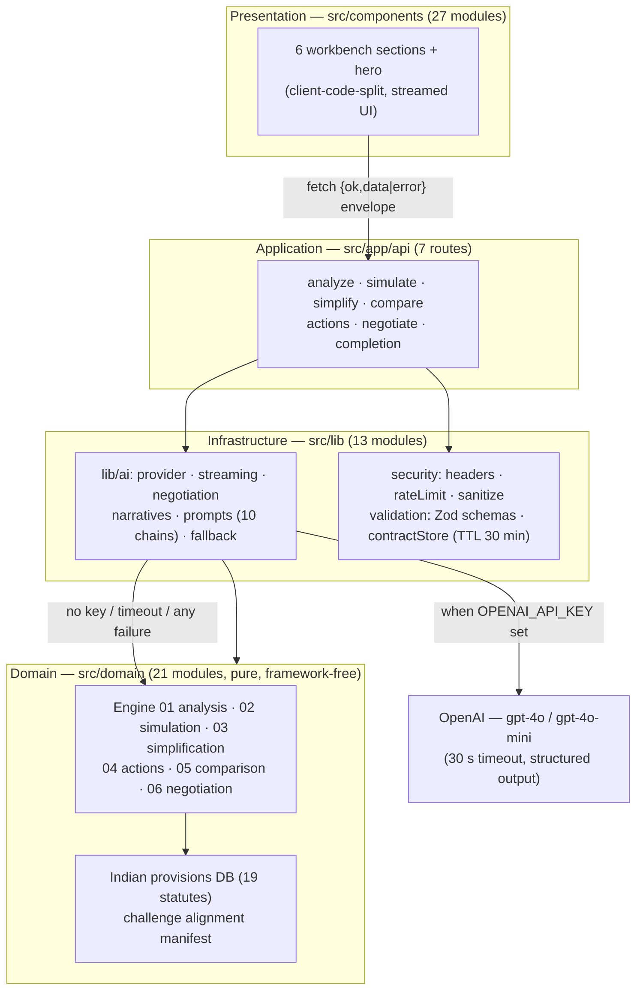

# NyayaLens AI

**GenAI legal intelligence for real people — not just lawyers.**

[-brightgreen)](TESTING.md)
[](TESTING.md)
[](TESTING.md)
[](https://nextjs.org/)
[-3178C6)](tsconfig.json)
[](https://nyayalens-ai-self.vercel.app)

**Challenge:** PromptWars — *“AI for Legal Assistance & Access”*: build a system using Generative AI that improves access to justice and is useful to real people, not just lawyers.

**Live:** https://nyayalens-ai-self.vercel.app · **Evidence pages:** [/quality](https://nyayalens-ai-self.vercel.app/quality) · [/architecture](https://nyayalens-ai-self.vercel.app/architecture) · [/challenge-alignment](https://nyayalens-ai-self.vercel.app/challenge-alignment)

NyayaLens AI is a legal-intelligence workbench with six analysis modes: adversarial dual-perspective contract analysis, a what-if scenario simulator, plain-language reframing, an action kit (negotiation points, redlines, lawyer prep sheet, compliance checklist), a clause-level comparator, and a three-agent negotiation matrix (Party A vs Party B vs Mediator) that produces a downloadable redline proposal. **Every AI surface is backed by a deterministic rule engine** — the product works, honestly and verifiably, with no API key at all.

## Honesty policy

Every number in this README was measured in-repo on 2026-09-26 (`npm run quality` reproduces all of them). There is no RAG, no vector database, no embeddings, and no fine-tuning — retrieval-style claims would be fabrication. Statutory citations are **rule-pinned**: the GenAI layer re-voices analysis language, but citations, risk levels, convergence scores, and redlines always come from deterministic engines grounded in a curated Indian-law database, so the model can never invent law. This tool provides legal *information*, not legal advice.

## Features → challenge keywords

| Problem-statement keyword | Feature | Where |
| --- | --- | --- |
| Simplifying complex legal documents | Plain Language Converter (EN/HI, grade 4–12 dial) | `src/components/sections/PlainLanguage.tsx` |
| Comparing contracts, agreements, or policies | Contract Comparator (semantic diff + risk delta) | `src/components/sections/Comparator.tsx` |
| Highlighting important clauses, obligations, risks | Adversarial Analysis (Party A/B perspectives, heatmap, timeline) | `src/components/sections/AdversarialAnalysis.tsx` |
| Answering questions based on provided legal documents | Scenario Simulator (what-if over your own contract) | `src/components/sections/ScenarioSimulator.tsx` |
| Understanding options and potential next steps | What-If Simulator (consequences / law / actions / risk gauge) | `src/components/sections/ScenarioSimulator.tsx` |
| Generating summaries, checklists, or other actionable outputs | Action Kit (5 tabs + Download All) | `src/components/sections/ActionKit.tsx` |
| Helping users prepare information for a legal professional | Lawyer Prep Sheet (questions + bundle export) | `src/components/sections/ActionKit.tsx` |
| *Beyond the keywords* | Multi-Agent Negotiation (3 rounds, mediator verdict, `.txt` redline export) | `src/components/sections/NegotiationMatrix.tsx` |

## Architecture

Vertical slices; dependencies point inward. Presentation → Application → Infrastructure → Domain. No circular dependencies, no `any`, strict TypeScript everywhere.



**API discipline:** every route follows validate (Zod) → rate-limit (100 req/min sliding window) → sanitize (HTML-stripping, 50k cap) → 30 s AI timeout → centralised prompt → AI call with rule fallback → typed `{ok, data | error}` JSON. The fallback message is always exactly *“AI analysis temporarily unavailable. Showing rule-based assessment.”* and responses carry an `x-nyayalens-degraded` marker where applicable.

## Legal grounding (Engine 06 + provisions DB)

`src/domain/legal/indian-provisions.ts` — 19 curated provisions with topic and contract-kind indexes, powering citations across simulation, negotiation, and redline output:

- **Bharatiya Nyaya Sanhita 2023** (in force 1 July 2024): §318 cheating (consolidating IPC 415/417/420) and §316 criminal breach of trust (consolidating IPC 405–409) — section numbers verified against the enacted statute, not legacy IPC numbering.
- **Indian Contract Act 1872**: §§10, 23, 25, 37, 39, 55, 56, 62, 73, 74.
- **Transfer of Property Act 1882**: §§105, 106, 108 · **RERA 2016**: §13 · **Consumer Protection Act 2019**: §2(47) · **IT Act 2000**: §10A · plus a specific-relief/injunction practice note.

The negotiation engine runs a fixed three-round protocol across 10 goal playbooks (deposit, notice, termination, penalty, payment, escalation, renewal, confidentiality, IP, general) with deterministic convergence ladders; the AI layer may re-voice positions but citations, convergence, agreement scores, and final redlines stay rule-pinned.

## Quality gates (measured 2026-09-26)

| Gate | Result |
| --- | --- |
| `npm run lint` (next lint) | 0 warnings / 0 errors |
| `npm run type-check` (strict + `noUncheckedIndexedAccess`) | 0 errors |
| `npm test` | **254/254 passing**, 24 suites |
| `npm run test:coverage` | stmts **99.06** · branches **94.91** · funcs **99.47** · lines **99.03** (enforced thresholds 98/90/98/98) |
| `npm run build` | 16 routes, home First Load JS **102 kB** (budget 120 kB) |
| Security headers | 10/10 on `/(.*)` incl. env-conditional CSP ([SECURITY.md](SECURITY.md)) |
| `npm audit` | known advisories on pinned `next@14` / `ai@4`; fixes exist only in majors that break the stack — documented accepted risk ([SECURITY.md](SECURITY.md)) |

## Setup

```bash
npm install
cp .env.example .env.local   # add OPENAI_API_KEY — optional; every feature works without it
npm run dev                  # http://localhost:3000
```

```bash
npm run quality        # lint + type-check + test:coverage + build + npm audit
npm test               # 254 tests, 24 suites
npm run test:coverage  # v8 coverage with enforced thresholds
```

## Stack (exact)

`next@14.2` · `react@18.3` · `ai@4` + `@ai-sdk/openai@1` (structured `generateObject` + `streamText`) · `tailwindcss@3.4` + `tailwindcss-animate` · `framer-motion@11` (scroll reveals only, disabled under `prefers-reduced-motion`) · `zod@3.23` · `lucide-react` · `sonner` · `lenis` · `clsx` + `tailwind-merge` · toolchain: TypeScript 5.4 strict, Vitest 4 + v8 coverage, ESLint (`next lint`). Zero external fonts or images; all icons are inline SVG.

## Known limitations (honest)

- Analysis state lives in an in-memory store (TTL 30 min, 200 contracts max) — per serverless instance, not shared across instances.
- No authentication or user accounts; rate limiting is per client key, not per user.
- Hindi rendering requires the AI layer; the no-key fallback serves English rule-based output with an explicit note.
- Lighthouse and screen-reader audits were not run in the build sandbox — see [EVALUATION.md](EVALUATION.md) for what is and is not verified.

## Docs

[SECURITY.md](SECURITY.md) · [TESTING.md](TESTING.md) · [ACCESSIBILITY.md](ACCESSIBILITY.md) · [EVALUATION.md](EVALUATION.md) · [.env.example](.env.example) — the same docs are served at [/docs/SECURITY.md](https://nyayalens-ai-self.vercel.app/docs/SECURITY.md) etc., kept byte-identical by a drift-guard test.
